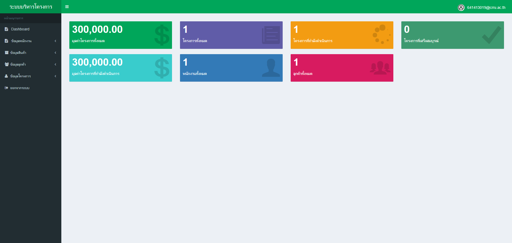

# PHP, SQL, JQuery,Bootstrap# ระบบติดตามโครงการนักศึกษา template by AdminLTE
* Natdanai Wongsa
### <ins> </ins> 

### <ins> </ins> 

### <ins>  </ins> 

### <ins> </ins> 

### <ins> </ins> 

### <ins>  </ins> 

### <ins>  </ins> 

### <ins>  </ins> 

### <ins>  </ins> 

### <ins>  </ins> 

### <ins>  </ins> 

### <ins>  </ins> 

